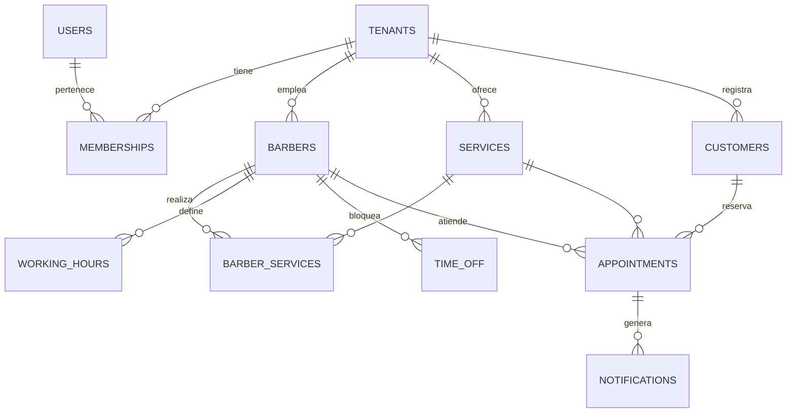

# BarberDesk — Plan de implementación

> Sistema web de citas para barberías, multi-tenant y multi-barbero.
> Fecha: 2026-08-28 · Estimaciones para un equipo de 1–2 desarrolladores full-stack.
> Las tareas ejecutables derivadas de este plan viven en [`docs/plan/`](./plan/README.md).

Plataforma SaaS donde cada barbería (tenant) administra sus barberos, servicios y horarios, y sus clientes reservan en línea desde una página pública propia.

---

## 1. Alcance y actores

| Actor | Qué hace |
|---|---|
| **Super Admin** | Opera la plataforma: alta de tenants, planes de suscripción, métricas globales, soporte. |
| **Dueño / Admin del tenant** | Configura su barbería: barberos, servicios, precios, horarios, branding y reportes. |
| **Barbero** | Ve y gestiona su agenda del día, marca citas completadas o no-show, bloquea horarios propios. |
| **Cliente** | Reserva sin fricción desde la página pública del tenant: servicio, barbero, fecha y hora. |

**Fuera de alcance inicial:** app móvil nativa, inventario/punto de venta, nómina y comisiones (ver Fase 4+).

---

## 2. Decisiones de arquitectura

### Multi-tenancy
**Base de datos compartida con columna `tenant_id` + Row-Level Security de PostgreSQL.**
Es el modelo con menor costo operativo para un SaaS que arranca (una sola migración, un solo pool de conexiones) y RLS da aislamiento real a nivel de motor, no solo en el código. Esquema-por-tenant o BD-por-tenant solo se justificarían con clientes enterprise que exijan aislamiento físico.

### Resolución de tenant
**Ruta por slug (`app.com/b/la-cueva`) en el MVP; subdominio (`la-cueva.app.com`) en Fase 2; dominio propio como feature de plan pago en Fase 3.**
El slug evita configurar DNS wildcard el primer día y la migración a subdominios es solo un middleware que extrae el tenant del host.

### Prevención de doble reserva
**Constraint `EXCLUDE USING gist` sobre `(barber_id, tstzrange(starts_at, ends_at))` en PostgreSQL.**
La base de datos rechaza físicamente dos citas solapadas del mismo barbero, sin importar cuántas instancias del servidor corran o qué condición de carrera ocurra en la aplicación. El código captura el error de conflicto y responde "ese horario acaba de ocuparse". Es la pieza más crítica del sistema y no debe depender solo de validación en la app.

### Zonas horarias
**Todo se persiste en UTC (`timestamptz`); cada tenant declara su `timezone` IANA** y la conversión ocurre solo en los bordes (UI y generación de slots). Los horarios de trabajo se guardan como hora local del tenant + día de semana, porque "abro a las 9" debe sobrevivir a cambios de horario de verano.

---

## 3. Stack tecnológico

| Capa | Elección | Por qué |
|---|---|---|
| Framework | Next.js 15 (App Router, TypeScript) | Un solo proyecto para página pública (SSR, buen SEO por barbería), paneles y API routes. |
| Base de datos | PostgreSQL 16 (Neon o Supabase) | RLS, constraint de exclusión, `tstzrange`. Serverless-friendly. |
| ORM | Prisma (+ SQL crudo para RLS y exclusión) | Migraciones y tipado; lo que Prisma no modela (EXCLUDE, policies) va en migraciones SQL manuales. |
| Autenticación | Auth.js v5 (email + Google) | Gratis, dueño de tus datos; la sesión lleva `tenant_id` y rol. Alternativa de pago: Clerk. |
| Email transaccional | Resend + React Email | Confirmaciones y recordatorios con plantillas en JSX. |
| WhatsApp / SMS | Meta WhatsApp Cloud API (o Twilio) | En LATAM el recordatorio por WhatsApp reduce no-shows mucho más que el email. Fase 2. |
| Pagos | Stripe y/o Mercado Pago | Stripe Billing para la suscripción SaaS del tenant; Mercado Pago para depósitos del cliente final en LATAM. Fase 3. |
| Jobs / cron | Vercel Cron o Trigger.dev | Recordatorios T-24h y T-2h, limpieza de holds, cierre de citas pasadas. |
| Hosting | Vercel (app) + Neon (BD) | Deploy continuo, previews por PR, wildcard subdomains soportados. |

---

## 4. Modelo de datos

Todas las tablas de negocio llevan `tenant_id` con policy RLS `tenant_id = current_setting('app.tenant_id')`.

| Tabla | Campos clave | Notas |
|---|---|---|
| `tenants` | name, slug, timezone, currency, plan, branding (logo, color) | Slug único global; timezone IANA obligatoria. |
| `users` | email, name, phone | Identidad global; puede pertenecer a varios tenants. |
| `memberships` | user_id, tenant_id, role | Rol: `owner` · `admin` · `barber`. Un user, N tenants. |
| `barbers` | tenant_id, user_id?, display_name, photo, bio, active | `user_id` opcional: un barbero puede existir sin cuenta de login. |
| `services` | tenant_id, name, duration_min, buffer_min, price, active | Duración + buffer definen el tamaño del slot. |
| `barber_services` | barber_id, service_id, price_override? | Qué servicios ofrece cada barbero, con precio propio opcional. |
| `working_hours` | barber_id, weekday, start_local, end_local | Varias franjas por día (mañana/tarde). Hora local del tenant. |
| `time_off` | barber_id, starts_at, ends_at, reason | Vacaciones, almuerzo, bloqueos puntuales. |
| `customers` | tenant_id, name, phone, email, notes | Perfil por tenant (no cuenta global): historial y preferencias. |
| `appointments` | tenant_id, barber_id, customer_id, service_id, starts_at, ends_at, status, price_at_booking, cancel_token | Status: `pending → confirmed → completed / cancelled / no_show`. Constraint EXCLUDE aquí. |
| `notifications` | appointment_id, channel, type, sent_at, status | Log idempotente: evita mandar dos veces el mismo recordatorio. |

---

## 5. Motor de disponibilidad

Algoritmo para *slots disponibles de un barbero en una fecha*:

1. **Base:** franjas de `working_hours` del día, convertidas de hora local del tenant a UTC.
2. **Restar:** `time_off` y `appointments` activas que se solapen.
3. **Cortar:** los huecos resultantes en slots de `duration + buffer` del servicio elegido, alineados a una grilla configurable (cada 15 o 30 min).
4. **Filtrar:** slots en el pasado y los que violen la antelación mínima/máxima del tenant (p. ej. "mínimo 1 h antes, máximo 30 días").

Al confirmar, la reserva se inserta en una transacción; si el constraint de exclusión dispara, se recalculan los slots y se informa al cliente. Con esto **no se necesita un sistema de "holds" o locks en el MVP** — se agrega en Fase 3 solo si se cobran depósitos (el hold vive lo que dura el checkout de pago).

---

## 6. Módulos de la aplicación

- **Página pública de reservas (por tenant):** flujo de 4 pasos — servicio → barbero (o "cualquiera") → fecha y hora → datos del cliente (nombre + teléfono, sin crear cuenta). Confirmación en pantalla y por email/WhatsApp con link de cancelación firmado (`cancel_token`). Branding del tenant.
- **Panel del tenant (admin):** agenda día/semana con columnas por barbero (crear, mover y cancelar citas, walk-ins incluidos), CRUD de barberos/servicios/horarios, ficha de clientes con historial, configuración del negocio y reportes.
- **Panel del barbero:** versión reducida y mobile-first — mi día, próximas citas, marcar completada / no-show, bloquear un hueco.
- **Consola super-admin:** listado de tenants, plan y estado de suscripción, impersonación para soporte, métricas de la plataforma.

---

## 7. Roadmap por fases

### Fase 0 — Fundaciones (1–2 semanas)
Esqueleto sobre el que todo lo demás se apoya sin retrabajos: repo, Next.js + TS, CI, esquema Prisma con RLS y EXCLUDE, Auth.js con tenant/rol en sesión, middleware de tenant por slug, onboarding mínimo.
**Criterio de salida:** dos tenants de prueba conviven sin ver datos del otro (test automatizado de aislamiento RLS).

### Fase 1 — MVP reservable (3–4 semanas)
Una barbería real puede recibir reservas en línea: CRUD de barberos/servicios/horarios, motor de disponibilidad con suite de tests (timezone, DST, solapes, buffers), página pública de reservas, agenda admin, emails transaccionales.
**Criterio de salida:** piloto con 1–2 barberías reales operando su agenda una semana completa.

### Fase 2 — Retención y operación diaria (2–3 semanas)
Reducir no-shows y que el panel sea el lugar donde la barbería vive: recordatorios WhatsApp/SMS T-24h y T-2h, reprogramación self-service, estados no-show/completada con cierre automático, panel del barbero mobile-first, subdominios, reportes básicos.
**Criterio de salida:** tasa de no-show del piloto medible y en descenso; barberos usando su panel a diario.

### Fase 3 — Monetización (3–4 semanas)
Convertir el producto en negocio: Stripe Billing con planes por tenant y gating de features, depósitos/prepago del cliente final con hold durante checkout, consola super-admin completa, dominio propio como feature premium.
**Criterio de salida:** primer tenant pagando; cobro de depósito de punta a punta en producción.

### Fase 4+ — Backlog de extensiones
Programa de lealtad, paquetes/membresías, comisiones por barbero, lista de espera, reseñas post-cita, app móvil (Expo reutilizando la API), integración con Google Calendar de cada barbero.

**Total estimado al primer tenant pagando: 9–13 semanas.**

---

## 8. Seguridad y calidad

- **Aislamiento:** RLS activo en toda tabla con `tenant_id`; test de integración que intenta cruzar tenants en cada endpoint.
- **Autorización:** chequeo de rol por capa de servicio (no solo en la UI); el barbero solo escribe sobre sus propias citas.
- **Endpoints públicos:** rate limiting en booking y disponibilidad (Upstash), validación con Zod, tokens de cancelación firmados y con expiración.
- **Datos:** backups automáticos + PITR de la BD; datos personales mínimos del cliente final (nombre y teléfono).
- **Pruebas:** unitarias para el motor de slots (la zona con más bugs posibles: DST, solapes, buffers), E2E con Playwright para el flujo de reserva.

---

## 9. Riesgos principales

| Riesgo | Mitigación |
|---|---|
| Doble reserva bajo concurrencia | Constraint EXCLUDE en BD (no confiar en la app); test de carrera automatizado. |
| Errores de timezone/DST | UTC en BD, hora local solo en bordes; suite de tests con fechas de cambio de horario. |
| Fuga de datos entre tenants | RLS como red de seguridad + tests de aislamiento por endpoint en CI. |
| Aprobación de plantillas WhatsApp demora | Iniciar el registro en Meta durante la Fase 1; email como fallback siempre activo. |
| Scope creep antes del piloto | Fase 1 se congela: nada de pagos ni features de plan hasta tener barberías reales usando la agenda. |
